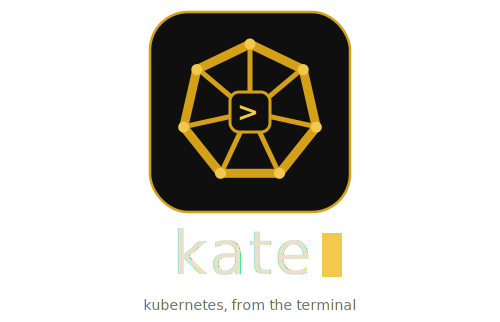
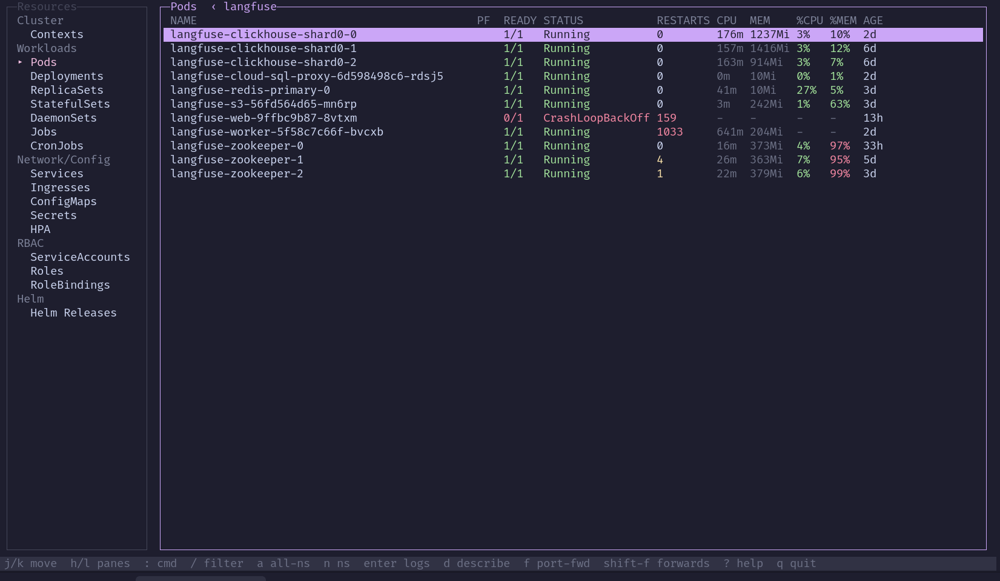

<p align="center">
  
</p>

A [k9s](https://k9scli.io/)-inspired Kubernetes TUI, built on [OpenTUI](https://github.com/anomalyco/opentui) (TypeScript + React, running on [Bun](https://bun.sh)).

kate is a fast, read-only terminal browser for your clusters. It talks to the Kubernetes API directly via `@kubernetes/client-node` — no `kubectl` or `helm` shell-outs — and gives you live resource lists, log following, describe, and port-forwarding with vim-style navigation.



## Features

- **Resource browser** — Pods, Deployments, ReplicaSets, StatefulSets, DaemonSets, Jobs, CronJobs, Services, Ingresses, ConfigMaps, Secrets, HPA, ServiceAccounts, Roles, RoleBindings, Helm releases, and cluster Events.
- **Live CPU / MEM** for pods via the metrics API, including `%CPU` / `%MEM` against limits/requests, color-coded by usage.
- **Live log following** — picks the container for multi-container pods, with JSON syntax highlighting, log-level coloring, and a line-wrap toggle.
- **Drill into logs** — press `enter` on a pod, or on a Job/Deployment/StatefulSet/DaemonSet/ReplicaSet to tail its pods (a picker appears when there's more than one).
- **Describe** — view any object as YAML, with server-side noise (`managedFields`, etc.) stripped.
- **Port-forward** — a dialog to pick `container::port` and a local port; forwarded pods are marked in the list, and you can review or stop all active forwards in one place.
- **Delete / uninstall** (`shift-d`) — pods, services, and Helm releases (a full `helm uninstall` via the API), behind a confirm dialog. Deleting a pod restarts it (its controller recreates it) to pick up new config. Mutating actions are **off by default**: flip *Edit mode* in Settings (`:config`) to enable them — the choice persists.
- **Context & namespace switching** in-app, with fuzzy search. kate remembers your last context and the namespace you used in each context, so it reopens where you left off.
- **Command palette** (`:`) with live fuzzy completion — jump to any resource, switch context/namespace, change theme, and more.
- **Fuzzy filter** (`/`) on every list.
- **Themes** — mustard (default), dracula, gruvbox, catppuccin, nord, mono — switchable live and remembered.

kate is **read-mostly**: it browses and streams. The only cluster mutations it performs are deleting a pod/service or uninstalling a Helm release — all off by default (opt in via *Edit mode* in Settings) and always behind a confirm dialog.

## Requirements

- [Bun](https://bun.sh)
- A working `kubeconfig`

## Install & run

```bash
cd app
bun install
```

Then launch with the wrapper script (recommended):

```bash
./bin/kate
```

The wrapper handles TLS for private CAs (e.g. GKE) — see [TLS](#tls) below — and restarts cleanly. You can also run it directly with `cd app && bun run start`, but private-CA clusters may fail TLS verification that way.

### tmux plugin

```tmux
set -g @plugin 'imsalik/kate'
```

`prefix + I` to install via TPM, then `prefix + k` opens the popup. Deps install themselves on first run.

### standalone CLI

Run `kate` from any shell by putting the wrapper on your `$PATH`. If you already have it via TPM, just symlink that copy:

```bash
ln -s ~/.tmux/plugins/kate/bin/kate ~/.local/bin/kate
```

Otherwise clone it somewhere and symlink `bin/kate`:

```bash
git clone https://github.com/imsalik/kate.git ~/.local/share/kate
ln -s ~/.local/share/kate/bin/kate ~/.local/bin/kate
```

Make sure `~/.local/bin` is on your `$PATH` (most setups already have it). Then run `kate` from any terminal. To update later: `git -C ~/.tmux/plugins/kate pull` (or pull wherever you cloned it).

## Usage

kate opens on your current context. Move with the arrow keys or `j`/`k`, switch panes with `tab`, and drill in with `enter`. Press `?` any time for the keybinding help, and `:` to open the command palette.

### Keybindings

| Key | Action |
|-----|--------|
| `j` / `k`, `↑` / `↓` | move down / up |
| `g` / `G`, `home` / `end` | jump to top / bottom (in logs: top / live tail) |
| `ctrl-d` / `ctrl-u`, `pgdn` / `pgup` | half-page down / up |
| `tab` | jump to the resource sidebar (from anywhere) |
| `h` / `l`, `←` / `→` | focus sidebar / table |
| `enter` / `l` | pods & workloads → logs · contexts → switch · else focus table |
| `d` | describe (YAML) |
| `shift-d` | delete pod/service · uninstall helm release (Edit mode + confirm) |
| `f` | port-forward (pick a port if several) |
| `shift-f` | list / stop active port-forwards |
| `w` | toggle line wrap (in logs) |
| `/` `<text>` | fuzzy filter the current list |
| `a` | toggle all-namespaces |
| `n` | open the Namespaces list (enter on one switches to it) |
| `r` | refresh now (lists also auto-refresh) |
| `esc` | back one step |
| `q` | quit |

### Command palette (`:`)

Press `:` for a popup with live fuzzy completion. `tab` completes the highlighted entry, `↑`/`↓` move, `enter` runs, `esc` cancels.

| Command | Action |
|---------|--------|
| `:pods` `:deploy` `:svc` `:sa` … | jump to any resource (short aliases work too, e.g. `:po`, `:rs`, `:cm`) |
| `:ctx [name]` | switch context — type a name to complete and switch, or omit it to open the Contexts list |
| `:ns [name]` | switch namespace — type a name to complete and switch, or omit it to open the Namespaces list |
| `:theme [name]` | change theme live (e.g. `:theme gruvbox`) |
| `:config` | open settings (includes a live theme picker) |
| `:pf` | active port-forwards |
| `:all` | toggle all-namespaces |
| `:q` | quit |

## tmux plugin

Open kate in a tmux popup on a keystroke. With [TPM](https://github.com/tmux-plugins/tpm):

```tmux
set -g @plugin 'imsalik/kate'
```

`prefix + I` to install via TPM. `prefix + k` opens the popup. Deps install themselves on first run.

### manual bind

```bash
git clone https://github.com/imsalik/kate ~/code/kate
```

```tmux
bind-key k display-popup -E -w 95% -h 90% '~/code/kate/bin/kate'
```

### options

```tmux
set -g @kate-key "k"            # bound key (default: k)
set -g @kate-no-prefix "off"    # "on" to bind without the prefix
set -g @kate-popup-width "95%"
set -g @kate-popup-height "90%"
set -g @kate-theme "nord"       # default theme
```

## Configuration

kate stores its config at `~/.config/kate/config.json` (or `$XDG_CONFIG_HOME/kate/config.json`; override the path with `$KATE_CONFIG`). It's written automatically and remembers your theme, last context, and the namespace per context.

### Themes

Available themes: `mustard` (default), `dracula`, `gruvbox`, `catppuccin`, `nord`, `mono`.

Change the theme live with `:config` or `:theme <name>` — your choice is saved. To set one at launch:

```bash
KATE_THEME=catppuccin ./bin/kate     # this launch only
tmux set-option -g @kate-theme nord  # default for the tmux plugin
```

Resolution order: `KATE_THEME` → saved config → `@kate-theme` (tmux) → `mustard`.

## TLS

Bun's `fetch` doesn't apply the per-cluster CA from your kubeconfig, so private-CA clusters (e.g. GKE) fail verification when kate is run directly. The `bin/kate` wrapper fixes this the way `kubectl`/k9s do: it trusts your clusters' CAs via `NODE_EXTRA_CA_CERTS`, keeping verification **on**. Set `KATE_INSECURE_TLS=1` to disable verification instead (not recommended).

